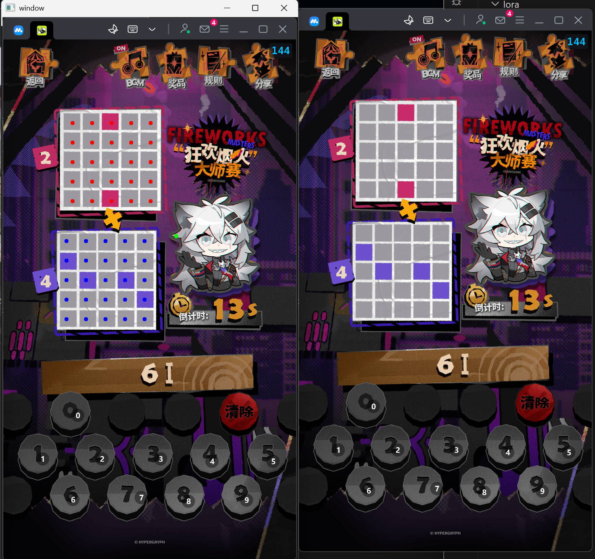

# 明日方舟 狂歡煙火大師賽 的自動點擊器
## 使用方式
1. 安裝：
    - `python`
    - `opencv-python`
    - `mss`
    - `pywin32`
    - `pynput`
2. Clone this Repo.
3. 將模擬器設置為 `1280*720`，如果你的模擬器不是 Mumu，記得在程式碼當中改名字。
4. 打開森空島，並打開這個遊戲。
5. 給 0~9 的數字設置鍵盤 0~9 的按鍵映射。
6. 執行 `autoclicker.py`
7. 觀察並調整紅色點 `red_pos`、藍色點 `blue_pos`、綠色點 `check_pos` 的位置，並確保：
    - 紅色點有覆蓋在紅色棋盤的灰色格子。
    - 藍色點有覆蓋在藍色棋盤的灰色格子。
    - 綠色點有覆蓋在拉狗最左邊的頭髮。
8. 調整完記得重新執行 `autoclicker.py` 才會生效。

## 聲明
1. 明日方舟、森空島等等是鷹角網絡的商標。
2. 本 Repo 僅供娛樂，本人不負任何使用本 Repo 造成的後果及責任。

## 其他說明
其實可以用 winapi 做鍵盤/滑鼠輸入，用 dx 或者 winapi 擷取視窗畫面，但主要是我懶。